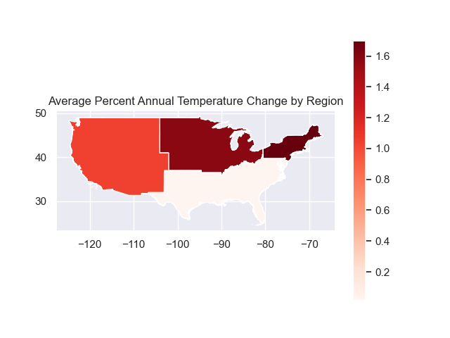
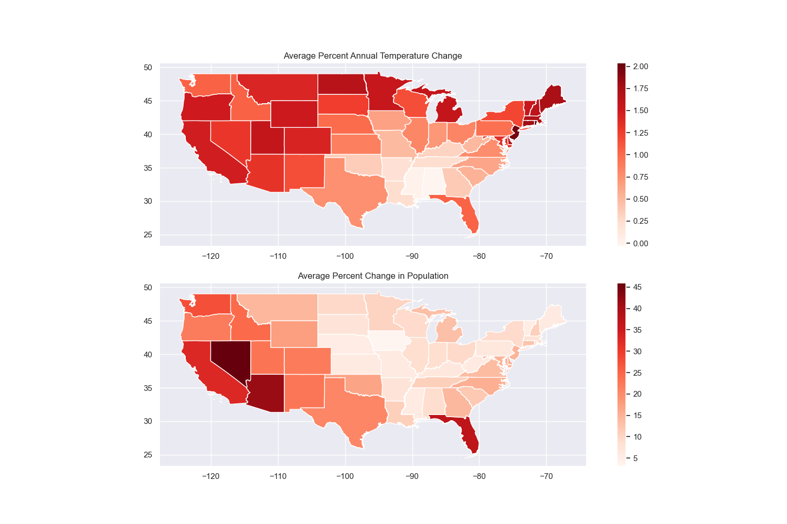
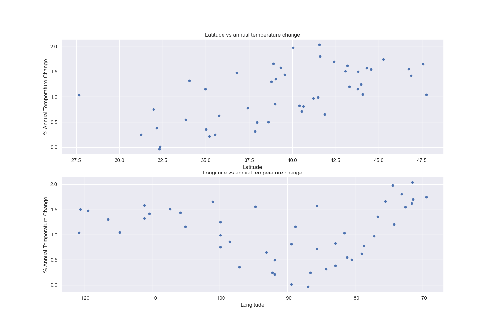
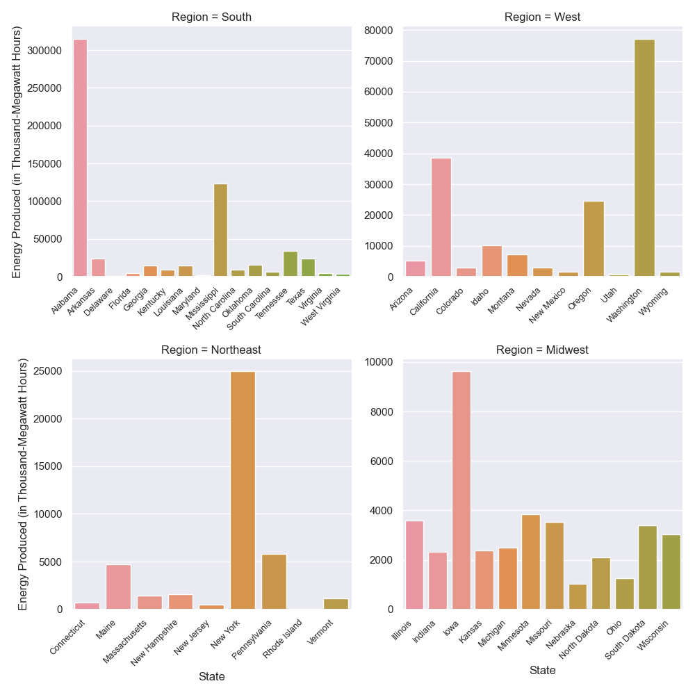
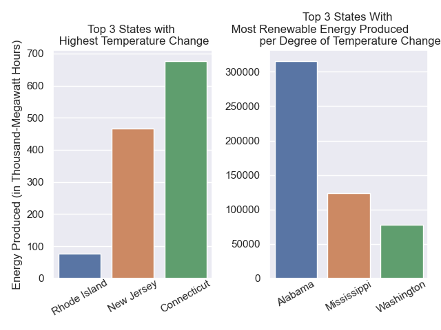

# Analyzing historical temperature (F) within the lower 48 states to predict future temperature changes.
#### **Authors:** Takumi Shimada, Owen Cheung, Julia Russell

### Summary of Questions and Findings
1. How has temperature changed in the US over time? Also is there a correlation between population change and temperature change?
    - We will find the patterns of how the temperature changes over time across the different US states.
    - **Results:** The general trend is of rising temperatures across the lower 48 states with the northeast region seeing the highest overall change in temperature based on the data. There is a slight visual correlation between population change and temperature change.

2. Does location affect temperature change?
    - We will compare how the location (latitude and longitude) affects temperature change.
    - **Results:**  As the latitude increases, the percentage of annual temperature change increases and the percentage of annual temperature change decreases, as the longitude increases, but after -90 degrees, it increases again.

3. What are the states where temperature is changing the most doing to combat climate change (in terms of generating renewable energy)?
    - We will compare the amount of renewable energy each state (separated by region) generates with how much their temperature is changing. We will also focus on the top 3 states with the largest temperature change (on average) and the top 3 states with the highest amount of renewable energy generation per degree of temperature change.
    - **Results:** The south has the two states with the most amount of renewable energy produced per degree of temperature change, followed by the west. Also, the top 3 states that have the highest temperature change are only producing a small fraction of renewable energy (per degree of temperature change) compared to the top 3 states that produce the highest amount of renewable energy (per degree of temperature change).

4. Is the amount of net generated renewable energy of a given state an accurate factor for predicting temperature change?
    - We know climate change affects the entire world but is it viable to use net generated renewable energy as a way to determine/predict how much a given state is doing to mitigate climate change? In other words, can we use how much renewable energy a given state generates as a way to predict how much that state is being affected by climate change? We will compare the accuracy of using only the amount of renewable energy a state produces to predict temperature change in that state by using both location and the amount of renewable energy produced and using only location to predict temperature change.
    - **Results:** The amount of renewable energy a state produces is not a more accurate feature to predict how a given state will be affected by climate change (in terms of temperature change) compared to using location data (latitude and longitude) as a feature.

### Motivation
Global warming is a serious problem today, and we expect temperatures to rise over the next few decades. Knowing the historical temperature will help us predict future temperature changes; hopefully, we will be able to see a pattern or some trends, which will help us see how much temperature will rise in the future and the consequences. It's critical to know future temperatures because global warming is still a significant issue, and it's better to recognize the current situation and prevent it.

### Datasets
1. Temperature data within the lower 48 states
    [Dataset](https://github.com/washingtonpost/data-2C-beyond-the-limit-usa)
    **Download:** /data/processed/model_state.csv
2. Renewable energy generation data for all 50 states
    [Dataset](https://www.eia.gov/state/search/#?1=104&5=124&8=68&a=true&r=false)
    **Download:** Scroll down and look at the title called *“State Renewable Electric Power Industry Net Generation, by Energy Source, Back to 2005”*.  From there, you must download each state individually as an excel file. Once you are in Excel, save it as a CSV. (Note, these datasets will not cleanly transfer to a CSV file)
3. Location data for each state in terms of latitude and longitude
    [Dataset](https://www.kaggle.com/datasets/paultimothymooney/latitude-and-longitude-for-every-country-and-state?resource=download)
    **Download:** Icon next to the dataset title
4. Region data for each state
    [Dataset](https://github.com/cphalpert/census-regions/blob/master/us%20census%20bureau%20regions%20and%20divisions.csv)
    **Download:** Manually copy-paste into an Excel sheet
5.  US state boundaries via US census
    [Dataset](https://www.census.gov/geographies/mapping-files/time-series/geo/carto-boundary-file.html)
    **Download:** Scroll down to the States category to download cb_2018_us_state_500k.zip
6. Population data from the US census
    [Dataset](https://www.census.gov/data/tables/time-series/dec/popchange-data-text.html)
    **Download:** Scroll to the bottom, and download the CSV file

### Methods
1. For our first research question, we began by importing datasets 1, 4, 5, and 6, converted the fips codes in dataset 5 to ints for merging later on, removed Alaska and Hawaii by fips code from dataset 5 as well, then performed a groupby() operation on dataset 6 with mean() as the aggregator function in order to get the average percent change in population for each state. Next, we were able to merge all the datasets together using fips codes and state names and filter the resulting data frame by dropping the NA values and only keeping columns “fips”, “State”, “Annual”, “Region”, “Percent Change in Resident Population”, and “geometry”. Using this filtered data, we were able to create two maps; one plotting the average percent temperature change by region, and another plotting average percent temperature change by state vs average percent change in population by state. For the first map, we first dissolved the data by region, then plotted the “Annual” column. For the second map, we created two subplots and plotted the “Annual” and “Percent Change in Resident Population” columns within each subplot respectively.

2. For our second research question, we plotted two separate scatter plot graphs that show how latitude and longitude affect temperature change. To find the latitude and longitude range of each state (excluding Alaska and Hawaii), we used datasets 1 and 3. We first performed a groupby() operation using the “STUSAB” attribute. Then we merged the two datasets. From the merged dataset, we selected the targeted columns we needed for plotting. Then after processing the dataset, we plotted the data. First, we sorted the data by state latitude in ascending order and plotted the data. Then we sorted the data by state longitude in ascending order and plotted the data.

3. For our third research question, because each state has its own table in the dataset (2), we need to splice them together. First, we will find the average amount of renewable energy each state generates (in terms of thousand-megawatt hours), then we can put all of the averages of each state in one table. Using the average temperature change from the ‘Annual’ column in the dataset (1), we will find how much renewable energy is produced per degree of temperature change. We will do so by dividing the average renewable energy of each state by the annual temperature change of that state. We will then split the states into the 4 regions like we did in the first research question and plot a bar chart. The x-axis will be ‘STATE-NAME’, the y-axis will be the amount of energy produced per degree of temperature change (in terms of thousand-megawatt hours), and the ‘Region’ column as our ‘col’ value. That is how the first plot is produced. The second plot was produced by ordering by finding the three rows with the largest value from the ‘Annual’ of the merged data from earlier. We will also find the three rows with the largest values with the largest amount of energy produced per degree of temperature change from the same merged data. We will then plot each set of three rows as its own bar chart.

4. For our fourth research question, we are going to compare the accuracy of using the following features to predict the temperature change of states: only the average renewable energy a state produces, the average renewable energy a state produces, and location (longitude and latitude), and only location. We will use a regressor model for all three feature combinations. For the feature of average renewable energy a state produces, we will use the averages we calculated from the dataset (2) in research question 3. For the feature of location, we will use the latitude and longitude of each state from the dataset (3). In our regression models, we will be splitting 80% of our data for training and the other 20% for testing. Using the mean squared error of each model, we will then compare the effectiveness of each model.

### Results

1. **Research Question:** How has temperature changed in the US over time? Also is there a correlation between population change and temperature change?

    

    From this visualization, we can conclude that the Northeast region has seen the greatest increase in temperature overall, followed by the Midwest region, the Western region, and finally the Southern region.

    

    From this visualization, we can conclude that there is some correlation between change in population and change in temperature. We can see from the visualization that the maps generally align with each other, the major differences being the upper midwest region and the northeast. This could be due to a minimal change in population while temperature could have been affected by something like an existing trend of human impact on the environment. One interesting difference that we can see from the states in comparison to the dissolved region map is that within each area there seem to be outliers such as Florida in the south, and New Jersey in the northeast. In general, the west has seen an all-around increase in temperatures.

2. **Research Question:** Research Question: Does location affect temperature change?

    

    As you can see from the result, the trend is that as the latitude increases, the percentage of annual temperature change increases in general and as the longitude increases, the percentage of annual temperature change decreases. However, after -90 degrees, the percentage of annual temperature change increases. We expect the first trend in terms of latitude because latitude is one of the primary factors that affect temperature. As latitude moves further away from the equator, the temperature falls because regions receive less sunlight
3. **Research Question:** What are the states with the temperature changing the most doing to combat climate change (in terms of generating renewable energy)?

    (Note for this research question, the phrase ‘the amount of energy a state produces’ will refer to the amount of renewable energy per degree of temperature change a state produces)

    

    The plot above describes the amount of energy each state (separated by region) produces. As shown in the plot, the South contains the top two states that produced the most energy, followed by the West, Northeast, and Midwest. However, it is important to note there are outliers in each region that do not fall in the ranking.

    

    From the plot above, we can conclude that the top three states that have the highest temperature change are producing a small fraction of the amount of energy compared to the top three states that produce the most energy. Thus, the three states in the left bar graph are not doing as much to combat climate change (in terms of producing renewable energy) as the three states in the right bar graph.

    However, it is important to understand that this plot might look a little different if we only compare the amount of renewable energy a state produces, not the amount of renewable energy per degree of temperature change. Alabama and Mississippi actually, on average, produce less renewable energy than Washington but Alabama's and Mississippi’s average temperature change is less than Washington’s. Thus, making their amount of renewable energy produced per degree of temperature change greater than Washington's. We chose to compare energy production in this way because it allows us to use a given state’s actions (renewable energy production) and the way they are being affected by climate change (temperature change) in one number.

    It is also important to understand that not every state is equal in the number of resources they have to produce renewable energy. So this analysis is not a critique of a given state’s actions for the amount of renewable energy it produces.

4. **Research Question:** Is the amount of net generated renewable energy of a given state an accurate factor for predicting temperature change?

    (Note because we used machine learning models that split our data randomly into training and testing sets, our mean squared error of each model will differ each time we run our code, so we will be talking about one particular set of errors)

    In all three regression models, they are predicting the temperature change of a given state. The three errors we received on one particular run of our code are (0.40121, 0.11238, and 0.09144). The first error, 0.40121, corresponds to the first model where we used only the amount of renewable energy a given state produces as a feature. The second error, 0.11238, corresponds to the second model where we used both the amount of renewable energy a given state produces and its location data, latitude, and longitude, as features. The third error, 0.09144, corresponds to the third model where we used only the location data of a given state as a feature.

    We can conclude from the first model that using only the amount of renewable energy a given state produces is not as accurate of a feature as using both the amount of energy and location data or just location data as features. From the second and third models, we can conclude that using location data alone is a more accurate feature than using both location data and the amount of energy produced. Thus we can conclude that the amount of renewable energy a state produces is not an accurate factor for predicting temperature change. We can further deduce that, generally, states do not produce a certain amount of renewable energy based on how the temperature is changing in their state.

### Impact and Limitations

It is important to understand that even though climate change affects the entire world, it affects certain regions differently than others. Thus, the actions of one region or state do not solely affect itself, so the amount of renewable energy a state does or does not produce is not a factor in its own temperature change. It is just one factor in how that state is responding to climate change and its efforts in mitigating the effects globally. As stated earlier, each state does not have an equal amount of resources for producing renewable energy or mitigating the effects of climate change. Therefore, our analysis is not a critique of a given state’s efforts and actions for mitigating climate change.

### Challenge Goals

1. Multiple Datasets | Multiple datasets related to climate change.
2. Machine learning | We will analyze historical temperature in the lower 48 states and predict its future temperature.
3. Messy data | We will have to put together several different CSV files to make a complete dataset and those CSV files are not cleanly presented.

### Testing

For research question 1, we constructed a smaller sample dataset consisting of just Alabama and Arizona to pass through to the processing method, then used asset_equals() to compare the results of that process to the expected results.

For research question 2, we tested two small datasets. One of them contains the percentage of the annual temperature change and STUSAB, and the other one contains the data about latitude and longitude for each state. As we tested these states, we used assert statements and we received the expected data frame in testing, so we’re confident about our results.

For research question 3, we tested the processing of the datasets involved in this question. We used a smaller version of dataset (2) that contains only three states. We then used assert_equal statements to check each of the numerical calculations that were involved in processing the data to ensure our graphs and analysis were accurate.

For research question 4, we used the processed dataset (2). Because the numerical calculations that are involved with processing that dataset were testing for research question 3, we did not make another test function specifically for research question 4.

### Collaboration
We consulted the documentation from the different python libraries we used when we ran into problems or for ideas when we were stuck.
